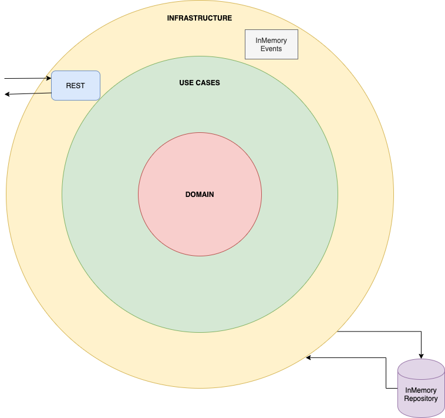

## Introduction

This microservice will be in charge of managing the creation and consultation of transactions

### Additional info

* Functional analysis: 
    * The entry point to the microservice is via REST

    * This microservice must connect to an accounts microservice that is responsible for providing the account balance to which the 
    transaction belongs and for updating the account balance when the transaction is created.
    In order to follow this flow, the accounts microservice has been simulated within this microservice. All the classes that are in the `com.ismaelmasegosa.transaction.challenge.infrastructure.account.balance.provider` package in the
    Infrastructure module belongs to an "external" accounts microservice.
    When a transaction has been created a memory event is published to simulate the interaction with the accounts microservice to update the account balance.
    
    * The repository has been implemented as in memory storage, to avoid depending on any external service.
    
    * When a request is received to check the status of the transaction and the channel is empty, I have assumed that the default channel is INTERNAL.
    
    
## Architecture

* The microservice has been implemented with Clean Architecture, separating the microservice into:
- Domain: Entities, event, services interface, repositories interface
- UseCase: Validation params, repositories calls, service calls
- Infrastructure: Controllers, clients, mappers, external dependencies
      
    

### Install

1. `mvn clean install -DskipTests`

### How to run
1. `mvn spring-boot:run -pl transaction-challenge-boot`

### How to run tests
1. `mvn clean verify`

    